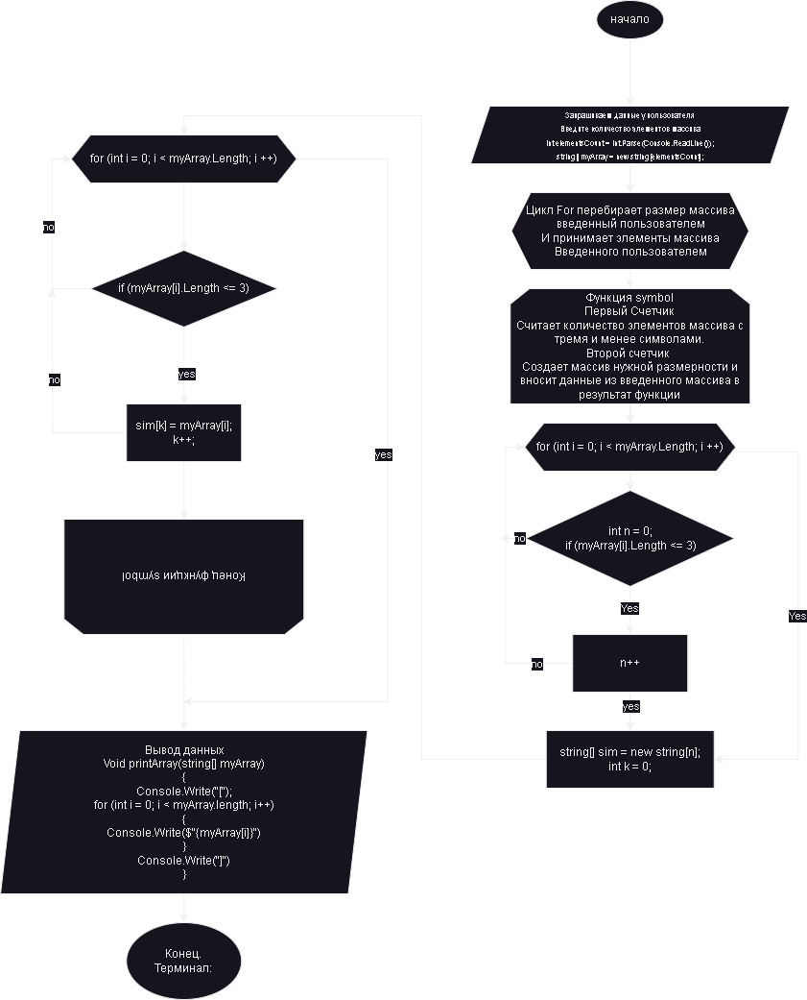

# Контрольная Работа.

## Описываю решение задачи:
- Задача: Написать программу, которая из имеющегося массива строк формирует новый массив из строк, длина которых меньше, либо равна 3 символам. 
- Первоначальный массив можно ввести с клавиатуры, либо задать на старте выполнения алгоритма. 
- При решении не рекомендуется пользоваться коллекциями, лучше обойтись исключительно массивами.

# Решение задачи.
## Первый Этап "Переменные, размер массива".
 - Для начала нам нужно создать переменные с выводом сообщения для пользовотеля. 
-  Дальше создаем переменную для принятия кол-во элементов массива от пользователя. 
-  Создаем массив. 

## Второй этап "Цикл, заполнения массива".
- Создаем цикл 
-  Просим пользователя заполнить массив.
-  Счетчик работает исходя из заданного размера массива пользователем.

### Третий этап "Функция **symbol**"
- Самый первый цикл **for** перебирает массив и считает кол-во элементов массива с тремя и менее символами.
-  Второй цикл **for** создает массив нужной размерностью и вносит данные из введенного массива в результат функсции.

## Четвертый этап "Выводим массив исходя из ТЗ"
- Создаем счетчик для вывода массива
- Вызываем функции т.к. без них не будет работать выше указаный код.

## Добавляем Блок схему
   